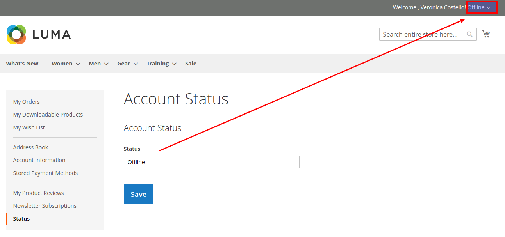
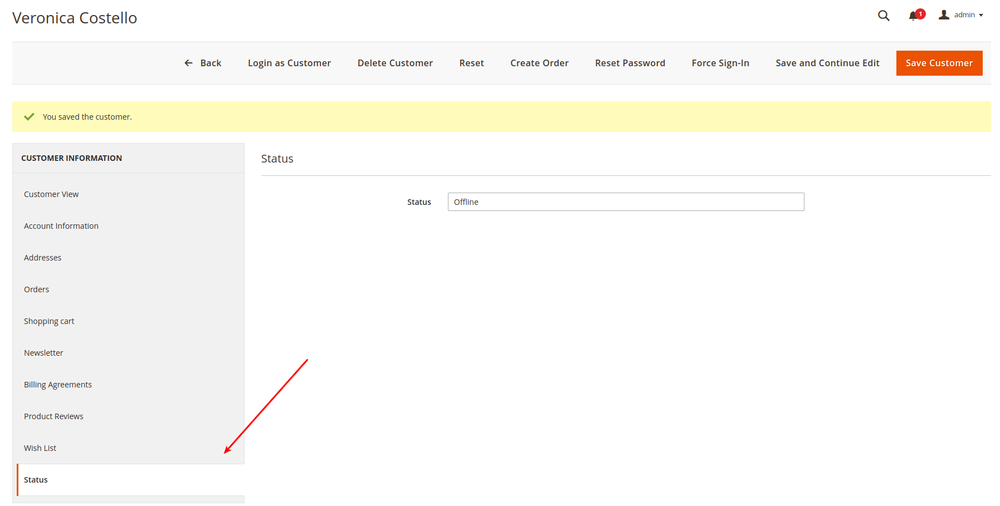

# extensions-customer-status
    Magento 2 module allow update customer status 

## Installation
    Go to root folder and run command
        composer require extensions/customer-status:dev-master
        php bin/magento setup:upgrade
        php bin/magento module:enable Extensions_CustomerStatus

## User Guide
### Frontend
    My Account -> Status

### Backend
    Customers -> Edit Customer -> Status

## Changelog
    * 1.0.0  - Initial module
    * 1.0.4  - Remove some class not neccessery
